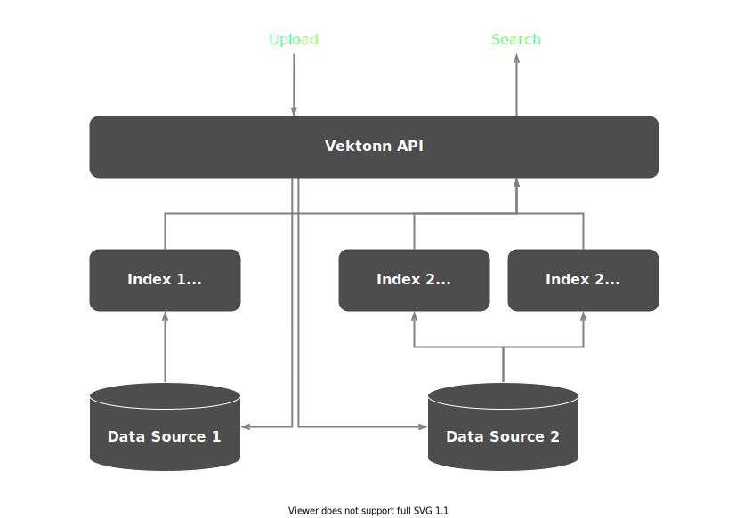

# Overview

**Vektonn** is a [high-performance](features.md#performance-and-scalability) battle-tested [kNN vector search](https://en.wikipedia.org/wiki/Nearest_neighbor_search#k-nearest_neighbors) engine for your data science applications. 
It helps you [manage vectors' lifecycle](features.md#vectors-lifecycle-management) and radically reduces time to market.

Vektonn has the following features:

- Support for both dense and sparse vectors
- Precise and approximate kNN (AkNN) algorithms
- Scalable architecture that allows to easily handle hundreds-of-GB-worth of vector data
- and [many more](features.md).

## Components

There are three main parts of Vektonn: an API, an Index, and a Data Source.

- The **API** has methods for search and uploading vector data. It proxies requests to corresponding Indices and Data Sources.
- A **Data Source** is where all the vectors' data being persistently stored. Currently, a Data Source is implemented using [Apache Kafka](https://kafka.apache.org/).
- An **Index** is an in-memory snapshot of data in Data Source. It updates asynchronously from a corresponding Data Source.

A data from a single Data Source can be spread (sharded) over several Indices to fit in RAM of hosting nodes.

A single Data Source may have several Indices defined on it with different metrics.

## GitHub repositories

- [**vektonn**](https://github.com/vektonn/vektonn) is a main repository with implementations for the API, Index shards and Data Sources. It also contains sources for [Vektonn's .NET client](https://www.nuget.org/packages/Vektonn.ApiClient).
- [**vektonn-index**](https://github.com/vektonn/vektonn-index) is a .NET library for finding nearest neighbors in vector space. It provides an implementation of basic functionality for Indices: vector storage and retrieval.
- [**vektonn-client-python**](https://github.com/vektonn/vektonn-client-python) hosts [Python client for Vektonn](https://pypi.org/project/vektonn) source code.
- [**vectonn-examples**](https://github.com/vektonn/vektonn-examples) is a repository with various examples of Vektonn usage.

## Support

If you have any questions or need help with Vektonn please contact us on [Slack channel](https://join.slack.com/t/vektonn/shared_invite/zt-yhiz2yoi-oKEA9UZgzMtgUky4PhdLwA).

## License

Vektonn is licensed under [Apache License 2.0](https://github.com/vektonn/vektonn/blob/master/LICENSE), so you may freely use it for commercial purposes.
